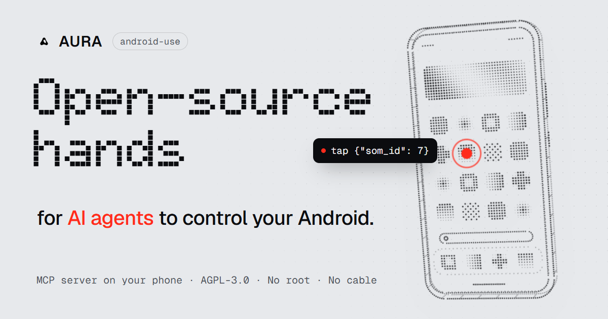
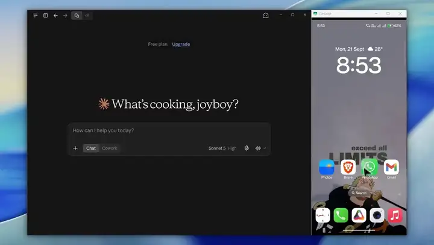
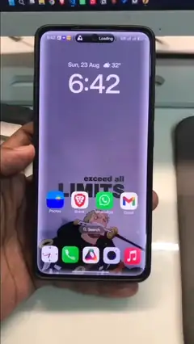
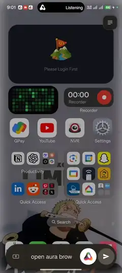
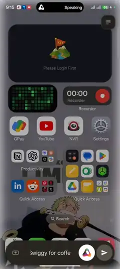
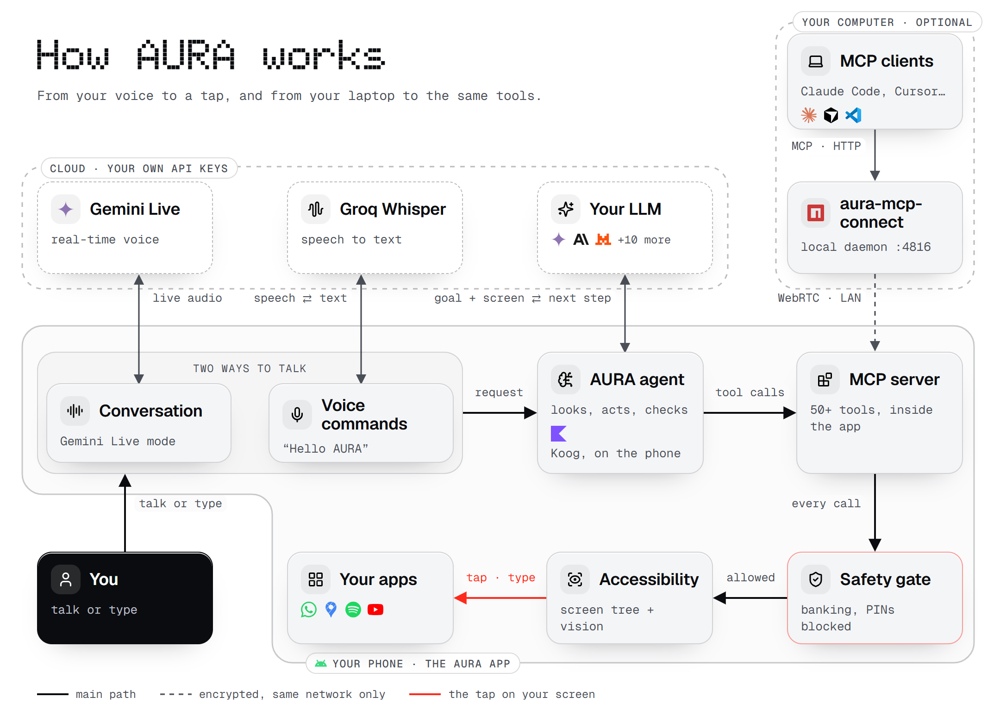

<p align="center">
  <a href="https://aura-android-use.vercel.app">
    
  </a>
</p>

<p align="center">
  <b>An AI that uses your Android phone the way you do.</b><br/>
  It reads the screen, taps, types and scrolls in your real apps. Ask it on the phone, or let
  Claude Code, Cursor and any MCP client on your computer drive it.<br/>
  No root. No cable. No AURA server in the middle.
</p>

<p align="center">
  <a href="https://github.com/Dinesh210805/aura-releases/releases/latest"></a>
  <a href="https://github.com/Dinesh210805/aura-releases/releases"></a>
  <a href="https://www.npmjs.com/package/aura-mcp-connect"></a>
  <a href="https://aura-android-use.vercel.app"></a>
  <a href="https://discord.com/invite/H66ws9zMPF"></a>
  <a href="LICENSE"></a>
</p>

<p align="center">
  <a href="https://github.com/Dinesh210805/aura-releases/releases/latest"><b>Download the APK</b></a>
  &nbsp;·&nbsp;
  <a href="https://aura-android-use.vercel.app"><b>Website</b></a>
  &nbsp;·&nbsp;
  <a href="#quick-start"><b>Quick start</b></a>
  &nbsp;·&nbsp;
  <a href="#how-it-works"><b>How it works</b></a>
  &nbsp;·&nbsp;
  <a href="#come-build-it-with-me"><b>Get involved</b></a>
</p>

---

## See it work

<p align="center">
  <a href="https://aura-android-use.vercel.app/media/mcp-instagram.mp4">
    
  </a>
  <br/>
  <sub><b>Over MCP:</b> Claude on a laptop shares an Instagram post to a story, on a real phone, through AURA.</sub>
</p>

<table>
  <tr>
    <td align="center" valign="top" width="25%">
      <a href="https://aura-android-use.vercel.app/media/rapido.mp4"></a><br/>
      <sub><b>By voice</b><br/>“Book a Rapido to Rock Beach, Puducherry.”</sub>
    </td>
    <td align="center" valign="top" width="25%">
      <a href="https://aura-android-use.vercel.app/media/lecafe.mp4"></a><br/>
      <sub><b>Search, then Maps</b><br/>“Find a highly rated café near Rock Beach, check it’s open today, and get directions.”</sub>
    </td>
    <td align="center" valign="top" width="25%">
      <a href="https://aura-android-use.vercel.app/media/amazon-flipkart.mp4"></a><br/>
      <sub><b>Two tabs</b><br/>“Compare the MX Master 3S on Amazon and Flipkart. Don’t buy.”</sub>
    </td>
    <td align="center" valign="top" width="25%">
      <a href="https://aura-android-use.vercel.app/media/swiggy.mp4"></a><br/>
      <sub><b>In-app browser</b><br/>“Open Swiggy and search for coffee. Don’t order.”</sub>
    </td>
  </tr>
</table>

<p align="center"><sub>Clips are sped up. Click one for the full recording.</sub></p>

## A quick note before you dive in

Hi, I'm Dinesh. AURA is a solo project: I design, build and test it on my own. It does real work
on real apps, as the clips above show, but it isn't perfect. Some apps fight back, some screens confuse it, and there are bugs I haven't met yet.
I've listed the ones I know about [below](#known-rough-edges).

I'm opening it up because I think more people should be able to give an AI a real phone, without
being locked into one company's assistant or one model. If that interests you, I'd really like to
hear from you. See [Come build it with me](#come-build-it-with-me).

## What it is

**🗣️ An assistant on your phone.** Say "Hello AURA", press both volume keys, or just type. Ask
for something ("message Mum that I'm running late", "turn on dark mode in Instagram") and the
agent does it in your real apps, step by step, while you watch. You can stop it at any point.

**🔌 An MCP server inside the phone.** The same 50+ tools are exposed over the
[Model Context Protocol](https://modelcontextprotocol.io), so an AI agent on your computer can
see and operate a real phone: test your own apps, automate chores, or give a coding agent hands.

**🧠 You pick the brain.** Gemini, Anthropic (Claude), OpenAI, Groq, OpenRouter, Mistral,
DeepSeek, xAI (Grok), Qwen, Moonshot (Kimi), Z.ai (GLM), Cerebras, Together AI, or any
OpenAI-compatible endpoint, with your own API key. Switch whenever you like.

## How it works

<p align="center">
  
</p>

1. **You ask**, by voice or text. There are two ways to talk:
   - **Voice commands** ("Hello AURA"): speech goes to Groq Whisper with your key and comes back as text.
   - **Conversation mode**: a real-time back-and-forth with Gemini Live, using your Gemini key. When you
     ask it to *do* something, it hands the task to the agent through one tool, `ask_aura`.
2. **The agent runs on the phone.** It sends your goal and what's on screen to the LLM you
   picked, and gets back the next tool to call.
3. **Every tool call goes through one MCP server and one safety gate**, whether it comes from
   the agent on the phone or from an MCP client on your computer. Blocked things stay blocked
   either way.
4. **The accessibility service does the actual work**: it reads the screen (with an on-device
   vision model for what the accessibility tree misses) and taps, types and scrolls.
5. **Your computer is optional.** `aura-mcp-connect` runs a small local daemon that MCP clients
   talk to, and it reaches the phone over an encrypted WebRTC link on your local network only.

<sub>The same diagram is on the website at [/architecture](https://aura-android-use.vercel.app/architecture).</sub>

## Highlights

| | |
|---|---|
| 👁️ **Sees the screen properly** | Every look combines the accessibility tree (exact and fast) with an on-device vision model (YOLOv8 + OCR) that finds what the tree misses: WebViews, games, maps, custom views. The agent picks numbered elements, never guessed coordinates. |
| ✅ **Acts, then checks** | Look, act, verify. A guard refuses to act without looking first, catches loops, and won't let the agent say "done" before checking. |
| ⚡ **Takes shortcuts** | Deep links jump straight to an app's screen, system intents handle calls, SMS, alarms and navigation, and a built-in browser works on the page, not on pixels. |
| 🎙️ **Voice** | Offline wake word ("Hello AURA", via sherpa-onnx), a volume-key shortcut, the Android assistant gesture, speech-to-text, spoken replies, and a Gemini Live conversation mode. |
| 🧠 **Remembers how apps work** | Encrypted per-app learnings, reusable skills, runs that survive the app being killed, and an `ask_user` tool so the agent asks instead of guessing. |
| 🔐 **Your computer, paired once** | Pair with a PIN; after that every MCP client on the computer shares one encrypted connection to the phone. |

## Quick start

### 1. Get the app on your phone

[Download the latest APK](https://github.com/Dinesh210805/aura-releases/releases/latest) and install
it, or [build it from source](#build-from-source). You need Android 8.0 or newer.

The first-run setup walks you through signing in, the permissions AURA needs (accessibility,
display over other apps, microphone, notifications, keyboard) and choosing an AI provider and key.

### 2. Use it on the phone

| To... | Do this |
|---|---|
| Talk to it | Say **"Hello AURA"** (turn on the wake word in Settings) |
| Open it anywhere | Press **both volume keys** together, or use the assistant gesture after picking AURA as your digital assistant app |
| Type instead | Open the assistant and type |
| Stop a task | Say **"stop"** (then "continue" or "drop it"), or tap the pause pill |

### 3. Connect your computer (optional)

Your computer and phone must be on **the same network**: the same Wi-Fi, or your computer on the
phone's hotspot. Nothing is reachable from the internet.

```bash
npm install -g aura-mcp-connect        # Node.js 18+
aura-mcp pair 123456                   # the PIN from AURA → MCP
```

Both screens show a 6-digit code. Approve on the phone only if they match. Then add AURA to your
client:

```bash
claude mcp add --transport http aura http://127.0.0.1:4816/mcp     # Claude Code
```

```json
{ "mcpServers": { "aura": { "command": "aura-mcp", "args": [] } } }
```

Away from home? Put both devices on [Tailscale](https://tailscale.com) and pair with
`aura-mcp pair 123456 --host=<the phone's 100.x address>`. Everything else about the bridge
(per-client setup, the optional `aura-adb` tool, troubleshooting) is in
[`aura-mcp-connect/README.md`](aura-mcp-connect/README.md).

## What the agent can do

<details>
<summary><b>All tools, by group</b></summary>
<br/>

| Group | Tools |
|---|---|
| **See** | `perceive_screen` · `read_screen` · `get_screenshot` · `watch_device_events` · `get_device_status` |
| **Touch** | `tap` · `double_tap` · `long_press` · `swipe` · `scroll_to` · `type_text` · `press_enter` |
| **Move around** | `press_home` · `press_back` · `open_recent_apps` · `launch_app` · `lookup_app` |
| **Shortcuts** | `list_app_deeplinks` · `resolve_deeplink` · `open_deeplink` · `system_intent` (call, SMS, alarm, timer, calendar, share, navigate) |
| **Browser** | `browser_open` · `browser_read` · `browser_act` · `browser_extract` · `browser_find` · `browser_wait` · `browser_tabs` · `browser_upload` · `browser_handoff` · `browser_screenshot` · `browser_close` |
| **Notifications & media** | `read_notifications` · `notification_action` · `dismiss_notification` · `get_media_sessions` · `media_control` · volume keys |
| **Contacts & files** | `resolve_contact` · `find_files` · `open_file` |
| **Check & finish** | `verify_action` · `wait_for` · `validate_action` · `end_session` |
| **Help** | `get_usage_guide` · `web_search` · `echo` |

</details>

The server also teaches clients how to use it: MCP **instructions** at connect time,
**resources** (its own safety policy, a tool-selection guide, live device status) and
**prompts** (task templates, plus any skills you add on the phone).

## Privacy and safety

- **No AURA server sees your content.** Screen content and requests go only to the AI provider
  you picked, with your key. Voice-to-text uses Groq Whisper with your Groq key, and Gemini Live
  mode streams audio to Google with your Gemini key. The wake word, the vision model and the
  safety checks run on the phone.
- **Your computer connects over your local network only.** No relay server, no STUN or TURN.
  A new computer needs the PIN shown on the phone, then your approval after comparing codes.
  After that it proves itself with a secret it never sends again.
- **Some things are always off-limits.** Banking, payment and authenticator apps can't be opened,
  and card numbers, PINs and passwords can't be typed. You can add your own restricted apps.
  Destructive actions ask first, and every tool call is logged on the phone.
- **Anonymous diagnostics are optional.** Crash reports and usage counts, never content. The
  full list is in the in-app privacy policy, and one switch in Settings turns it off.

## Known rough edges

Being honest about what doesn't work yet:

- **A few apps ignore taps from an accessibility service.** When an app does, the built-in
  browser or a deep link is usually the way around it.
- **Google Pay and some banking apps refuse to run while any accessibility service is on.**
  That's their rule, not AURA's, and AURA stays out of banking apps anyway.
- **Google sign-in doesn't work inside AURA's browser.** Google blocks sign-in in every embedded
  browser.
- **Your own builds still lean on Firebase** for sign-in, crash reports and remote config. Debug
  builds let you skip sign-in, and a build without Firebase is on the list.
- **I test on the phones I have.** Yours may well find new bugs. Please tell me when it does.

## Downloads and deployments

| What | Where | Latest |
|---|---|---|
| **Android app** (signed APK) | [GitHub Releases on `aura-releases`](https://github.com/Dinesh210805/aura-releases/releases) | <a href="https://github.com/Dinesh210805/aura-releases/releases/latest"></a> |
| **Desktop bridge** (`aura-mcp-connect`) | [npm](https://www.npmjs.com/package/aura-mcp-connect) | <a href="https://www.npmjs.com/package/aura-mcp-connect"></a> |
| **Website** | [aura-android-use.vercel.app](https://aura-android-use.vercel.app), deployed by Vercel from [`aura-android-use-website/`](aura-android-use-website/) on every push to `main` | <a href="https://aura-android-use.vercel.app"></a> |

APKs live in a separate `aura-releases` repository because installed copies of the app check it
for updates.

## Build from source

You need **JDK 17**, the **Android SDK (API 36)**, and for the bridge, **Node.js 18+**.

**Local settings.** Copy `aura-android/local.properties.example` to `local.properties` and set
your SDK path (Android Studio does this for you). Release signing keys go there too. There is no
`.env` file: AI provider keys are entered in the app, under **Settings → Agent Brain**.

**Firebase.** The app uses Firebase for sign-in, crash reports, analytics and remote config.

- **Just trying it?** Copy `aura-android/app/google-services.example.json` to
  `google-services.json` in the same folder. A debug build compiles with it and lets you skip
  sign-in during setup. Anything that needs Firebase won't work.
- **Want everything?** Create a Firebase project, add Android apps with the package names
  `com.aura.aura_ui.feature` and `com.aura.aura_ui.feature.debug`, enable **Authentication**
  (Google and Anonymous), **Firestore**, **Remote Config**, **Crashlytics** and **Analytics**,
  and download its `google-services.json` to `aura-android/app/`.

```bash
cd aura-android
./gradlew :app:assembleDebug          # gradlew.bat on Windows
./gradlew :app:testDebugUnitTest :mcp-server:test

cd ../aura-mcp-connect
npm install && npm test
```

The first build downloads the wake-word engine (sherpa-onnx, ~28 MB) once.

## Project layout

```
aura-android/
├── app/          The Android app: UI, the on-device agent, voice, accessibility and gestures
│   └── src/main/java/com/aura/aura_ui/
│       ├── agent/          agent loop, LLM providers, memory, skills, run ledger, ask_user
│       ├── accessibility/  reading the screen and performing gestures
│       ├── overlay/        the assistant overlay
│       ├── voice/          wake word and listening modes
│       ├── presentation/   screens (has a README)
│       └── remote/         kill switch, version gate, sign-in, diagnostics (has a README)
└── mcp-server/   The MCP server the app hosts: tools, safety policy, LAN pairing (pure Kotlin)
aura-mcp-connect/          Desktop bridge (Node.js, MIT) that connects MCP clients to the phone
aura-android-use-website/  The website (static, deployed by Vercel)
models/                    Config and licence of the on-device icon detector (the model ships in the app's assets)
scripts/                   Evaluation and benchmarking tools
docs/                      The evaluation task list, generated from the app's eval suite
```

## Come build it with me

AURA has one maintainer, so every good bug report, idea and pull request makes a real difference.
If you work on agents, Android internals, MCP or on-device ML, or you just like breaking things,
you're exactly who I'd love to hear from.

- **Chat:** come say hi on [Discord](https://discord.com/invite/H66ws9zMPF).
- **Found a bug?** [Open an issue](https://github.com/Dinesh210805/aura-android-use/issues). A
  screen recording and your phone model help more than anything.
- **Want to fix something?** Pull requests are welcome. Read [`AGENTS.md`](AGENTS.md) first: it
  has the build commands, the comment standard and the rule to update folder READMEs in the same
  commit, and it's written for human contributors and coding agents alike. Run the tests above
  before you open the PR. On your first one, a bot asks you to sign the [CLA](CLA.md) once; it
  keeps the project able to offer a commercial licence alongside the AGPL.
- **Security problem?** Please use GitHub's private vulnerability reporting (the **Security**
  tab) instead of a public issue.
- **Anything else:** [dinesh210805@gmail.com](mailto:dinesh210805@gmail.com).

## License

Copyright (C) 2026 Dinesh Kumar C. AURA is free software under the **GNU Affero General Public
License v3.0 or later**. See [`LICENSE`](LICENSE).

- **Use it, change it, share it, even sell it.** Anything you distribute or run as a service that's
  built on AURA must publish its full source under the same licence.
- **The Android app links a few closed Google libraries.** An extra permission in
  [`LICENSE-EXCEPTION.md`](LICENSE-EXCEPTION.md) makes that legal to distribute.
- **Want to ship it closed-source?** That needs a commercial licence. See
  [`COMMERCIAL-LICENSE.md`](COMMERCIAL-LICENSE.md).
- **Bundled models and libraries** keep their own licences. See
  [`THIRD_PARTY_NOTICES.md`](THIRD_PARTY_NOTICES.md).
- **`aura-mcp-connect/`** is separately licensed under MIT.

## Built with

[Koog](https://github.com/JetBrains/koog) (agent framework) ·
[MCP Kotlin SDK](https://github.com/modelcontextprotocol/kotlin-sdk) ·
[Stream WebRTC Android](https://github.com/GetStream/webrtc-android) ·
[sherpa-onnx](https://github.com/k2-fsa/sherpa-onnx) (wake word) ·
[ONNX Runtime](https://onnxruntime.ai) with an [OmniParser](https://github.com/microsoft/OmniParser)
icon detector · [ML Kit](https://developers.google.com/ml-kit) text recognition ·
[Silero VAD](https://github.com/snakers4/silero-vad). Diagram icons from
[Lucide](https://lucide.dev) (ISC).

<p align="center">
  <sub>Built by one person. If AURA is useful to you, a ⭐ helps other people find it.</sub>
</p>
