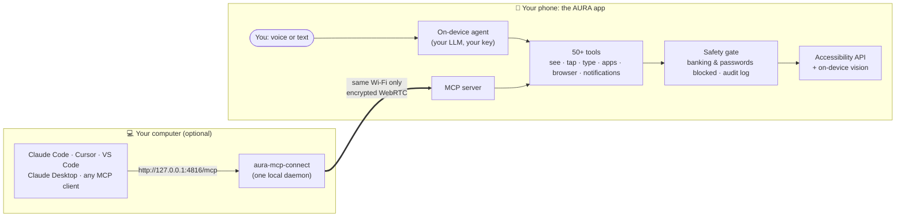

<h1 align="center">AURA</h1>

<p align="center">
  <strong>An AI that uses your Android phone the way you do: it looks at the screen, taps, types and scrolls.</strong><br/>
  Talk to it on the phone, or let Claude Code, Cursor and other MCP clients on your computer drive it.<br/>
  No root, no ADB, and no AURA server in the middle.
</p>

<p align="center">
  
  
  
  
  
</p>

---

## What is this?

AURA is two things in one Android app:

1. **An assistant on your phone.** Say "Hello AURA", press both volume keys, or type. Ask for
   something ("message Mum that I'm running late", "turn on dark mode in Instagram") and an
   on-device agent does it in the real apps, step by step, while you watch.
2. **An MCP server inside the phone.** The same 50+ tools are exposed over the
   [Model Context Protocol](https://modelcontextprotocol.io), so an AI agent on your computer
   can see and operate a real phone. Useful for testing your own apps, automating chores, or
   giving a coding agent hands.

You bring the brain: pick Gemini, Groq, OpenRouter, OpenAI, Anthropic or any OpenAI-compatible
endpoint, and use your own API key.



## Highlights

- **Sees the screen properly.** Every look combines the accessibility tree (exact and fast) with
  an on-device vision model (YOLOv8 + OCR) that finds buttons the tree can't see: WebViews,
  games, maps, custom views. The agent picks numbered elements, never guessed coordinates.
- **Acts, then checks.** Perceive → act → verify. A guard refuses to act without looking first,
  catches loops, and won't let the agent say "done" before checking.
- **Takes shortcuts when it can.** Deep links jump straight into an app's screen, system intents
  handle calls, SMS, alarms and navigation, and a built-in browser works at the page level
  instead of tapping pixels.
- **Voice.** Offline wake word ("Hello AURA", via sherpa-onnx), a volume-key shortcut, the
  Android assistant gesture, speech-to-text, spoken replies, and a Gemini Live conversation mode.
- **Remembers how apps work.** Encrypted per-app learnings, reusable skills, runs that survive
  the app being killed, and an `ask_user` tool so the agent asks instead of guessing.
- **Your computer drives the phone over MCP.** Pair once with a PIN; after that every MCP client
  on the computer shares one encrypted connection to the phone.

## Quick start

### 1. Get the app on your phone

Download the latest APK from [Releases](https://github.com/Dinesh210805/aura-releases/releases/latest)
and install it, or [build it from source](#build-from-source). You need Android 8.0 or newer.

The first-run setup walks you through signing in, the permissions AURA needs (accessibility,
display over other apps, microphone, notifications, keyboard) and choosing an AI provider and key.

### 2. Use it on the phone

| To... | Do this |
|---|---|
| Talk to it | Say **"Hello AURA"** (turn on the wake word in Settings) |
| Open it anywhere | Press **both volume keys** together, or use the assistant gesture after picking AURA as your digital assistant app |
| Type instead | Open the assistant and type |
| Stop a task | Say **"stop"** (then "continue" or "drop it"), or tap the pause pill |

### 3. Connect your computer (optional)

Your computer and phone must be on **the same network**: the same Wi-Fi, or your computer on the
phone's hotspot. Nothing is reachable from the internet.

```bash
npm install -g aura-mcp-connect        # Node.js 18+
aura-mcp pair 123456                   # the PIN from AURA → MCP
```

Both screens show a 6-digit code. Approve on the phone only if they match. Then add AURA to your
client:

```bash
claude mcp add --transport http aura http://127.0.0.1:4816/mcp     # Claude Code
```

```json
{ "mcpServers": { "aura": { "command": "aura-mcp", "args": [] } } }
```

Away from home? Put both devices on [Tailscale](https://tailscale.com) and pair with
`aura-mcp pair 123456 --host=<the phone's 100.x address>`. Everything else about the bridge
(per-client setup, the optional `aura-adb` tool, troubleshooting) is in
[`aura-mcp-connect/README.md`](aura-mcp-connect/README.md).

## What the agent can do

| Group | Tools |
|---|---|
| **See** | `perceive_screen` · `read_screen` · `get_screenshot` · `watch_device_events` · `get_device_status` |
| **Touch** | `tap` · `double_tap` · `long_press` · `swipe` · `scroll_to` · `type_text` · `press_enter` |
| **Move around** | `press_home` · `press_back` · `open_recent_apps` · `launch_app` · `lookup_app` |
| **Shortcuts** | `list_app_deeplinks` · `resolve_deeplink` · `open_deeplink` · `system_intent` (call, SMS, alarm, timer, calendar, share, navigate) |
| **Browser** | `browser_open` · `browser_read` · `browser_act` · `browser_extract` · `browser_find` · `browser_wait` · `browser_tabs` · `browser_upload` · `browser_handoff` · `browser_screenshot` · `browser_close` |
| **Notifications & media** | `read_notifications` · `notification_action` · `dismiss_notification` · `get_media_sessions` · `media_control` · volume keys |
| **Contacts & files** | `resolve_contact` · `find_files` · `open_file` |
| **Check & finish** | `verify_action` · `wait_for` · `validate_action` · `end_session` |
| **Help** | `get_usage_guide` · `web_search` · `echo` |

The server also teaches clients how to use it: MCP **instructions** at connect time,
**resources** (its own safety policy, a tool-selection guide, live device status) and
**prompts** (task templates, plus any skills you add on the phone).

## Privacy and safety

- **No AURA server sees your content.** Screen content and requests go only to the AI provider
  you picked, with your key. Voice-to-text uses Groq Whisper with your Groq key, and Gemini Live
  mode streams audio to Google with your Gemini key. The wake word, the vision model and the
  safety checks run on the phone.
- **Your computer connects over your local network only.** No relay server, no STUN or TURN.
  A new computer needs the PIN shown on the phone, then your approval after comparing codes.
  After that it proves itself with a secret it never sends again.
- **Some things are always off-limits.** Banking, payment and authenticator apps can't be opened,
  and card numbers, PINs and passwords can't be typed. You can add your own restricted apps.
  Destructive actions ask first, and every tool call is logged on the phone.
- **Anonymous diagnostics are optional.** Crash reports and usage counts, never content. The
  full list is in the in-app privacy policy, and one switch in Settings turns it off.

## Build from source

You need **JDK 17**, the **Android SDK (API 36)**, and for the bridge, **Node.js 18+**.

**Firebase (for now).** The app uses Firebase for sign-in, crash reports, analytics and remote
config, so the build needs a `google-services.json`:

1. Create a Firebase project and add an Android app with package name
   `com.aura.aura_ui.feature` (add `com.aura.aura_ui.feature.debug` too for debug builds).
2. Enable **Authentication** (Google and Anonymous), **Firestore**, **Remote Config**,
   **Crashlytics** and **Analytics**.
3. Download `google-services.json` to `aura-android/app/`. The expected shape is in
   `aura-android/app/google-services.example.json`.

A build without Firebase is planned.

**Local settings.** Copy `aura-android/local.properties.example` to `local.properties` and set
your SDK path (Android Studio does this for you). Release signing keys go there too. There is no
`.env` file: AI provider keys are entered in the app, under **Settings → Agent Brain**.

```bash
cd aura-android
./gradlew :app:assembleDebug          # gradlew.bat on Windows
./gradlew :app:testDebugUnitTest :mcp-server:test

cd ../aura-mcp-connect
npm install && npm test
```

The first build downloads the wake-word engine (sherpa-onnx, ~28 MB) once.

## Project layout

```
aura-android/
├── app/          The Android app: UI, the on-device agent, voice, accessibility and gestures
│   └── src/main/java/com/aura/aura_ui/
│       ├── agent/          agent loop, LLM providers, memory, skills, run ledger, ask_user
│       ├── accessibility/  reading the screen and performing gestures
│       ├── overlay/        the assistant overlay
│       ├── voice/          wake word and listening modes
│       ├── presentation/   screens (has a README)
│       └── remote/         kill switch, version gate, sign-in, diagnostics (has a README)
└── mcp-server/   The MCP server the app hosts: tools, safety policy, LAN pairing (pure Kotlin)
aura-mcp-connect/ Desktop bridge (Node.js, MIT) that connects MCP clients to the phone
models/           Config and licence of the on-device icon detector (the model ships in the app's assets)
scripts/          Evaluation and benchmarking tools
```

## Contributing

Issues and pull requests are welcome.

- On your first pull request a bot asks you to sign the [CLA](CLA.md). It keeps the project
  able to offer a commercial licence alongside the AGPL.
- Read [`AGENTS.md`](AGENTS.md) before changing code. It has the build commands, the comment
  standard and the rule to update folder READMEs in the same commit. It's written for human
  contributors and coding agents alike.
- Run the tests above before opening a pull request.
- Found a security problem? Please use GitHub's private vulnerability reporting (the
  **Security** tab) instead of a public issue.

## License

AURA is free software under the **GNU Affero General Public License v3.0 or later**. See
[`LICENSE`](LICENSE).

- **Use it, change it, share it, even sell it.** Anything you distribute or run as a service that's
  built on AURA must publish its full source under the same licence.
- **The Android app links a few closed Google and Picovoice libraries.** An extra permission in
  [`LICENSE-EXCEPTION.md`](LICENSE-EXCEPTION.md) makes that legal to distribute.
- **Want to ship it closed-source?** That needs a commercial licence. See
  [`COMMERCIAL-LICENSE.md`](COMMERCIAL-LICENSE.md).
- **Contributing?** You sign the [CLA](CLA.md) once, on your first pull request.
- **Bundled models and libraries** keep their own licences. See
  [`THIRD_PARTY_NOTICES.md`](THIRD_PARTY_NOTICES.md).
- **`aura-mcp-connect/`** is separately licensed under MIT.

## Built with

[Koog](https://github.com/JetBrains/koog) (agent framework) ·
[MCP Kotlin SDK](https://github.com/modelcontextprotocol/kotlin-sdk) ·
[Stream WebRTC Android](https://github.com/GetStream/webrtc-android) ·
[sherpa-onnx](https://github.com/k2-fsa/sherpa-onnx) (wake word) ·
[ONNX Runtime](https://onnxruntime.ai) with an [OmniParser](https://github.com/microsoft/OmniParser)
icon detector · [ML Kit](https://developers.google.com/ml-kit) text recognition ·
[Silero VAD](https://github.com/snakers4/silero-vad).
